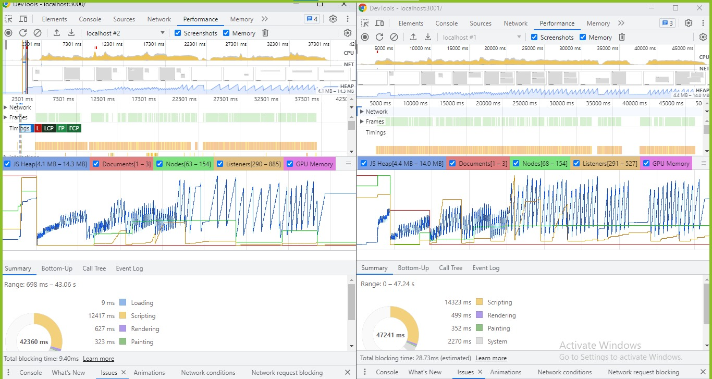
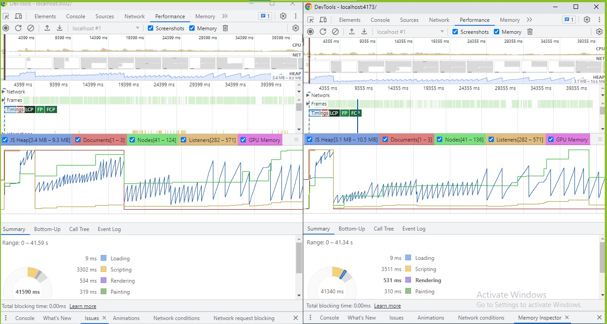

# React Modal

## Linaria VS Styled Components Benchmark

### Development Build Performance



### Build Script

| Name            | Styled Components | Linaria      | Better            |
| --------------- | ----------------- | ------------ | ----------------- |
| Index.html Size | 0.36 kB           | 0.42 kB      | Styled Components |
| CSS Size        | 0                 | 2.21 kB      | Styled Components |
| JS Size         | 232.48 kB         | 201.53 kB    | Linaria           |
| Total Size      | 232.84 kB         | 204.16 kB    | Linaria           |
| Gzip CSS Size   | 0                 | 0.58         | Styled Components |
| Gzip JS Size    | 74.05 kB          | 63.07 kB     | Linaria           |
| Gzip Total Size | 74.41 kB          | 64.07 kB     | Linaria           |
| Build Time      | 14.95 Seconds     | 17.1 Seconds | Styled Components |

#### Styled Components

```
✓ 159 modules transformed.
build/index.html 0.36 kB
build/assets/index-1654d308.js 232.48 kB │ gzip: 74.05 kB
```

#### Linaria

```
✓ 148 modules transformed.
build/index.html 0.42 kB
build/assets/index-9bbf26b4.css 2.21 kB │ gzip: 0.58 kB
build/assets/index-15db93b4.js 201.53 kB │ gzip: 63.07 kB
```

### Production Build Performance

-   Styled Components: Blocking time: 130ms
-   Linaria: Blocking time: 0ms



## Guide

### Install Dependencies

```bash
npm install
```

### Environment Variables

All environment variables for react application must start with `APP_` prefix

To change env prefix change add or remove string from `envPrefix` variable in [`vite.config.json`](./vite.config.ts)

Environtment variables can be accesed using `env.<name>` or [`import.meta.env.<name>`](https://vitejs.dev/guide/env-and-mode.html). Prefix must be included.

Declare env types in `src/env.d.ts` in `ImportMetaEnv` interface

The environment variables can be found and modified in the `.env` file. They come with these default values:

```bash
# Port number (optional, default: 3000)
PORT=3000

# Open browser on start (optional, default: true) if value is other than "true" it will be read as false
OPEN_BROWSER=true
```

## Available Scripts

In the project directory, you can run:

### Start

Start development build

```bash
npm start
```

### Build

build for production.

```bash
npm run build
```

### Preview

Preview production build

```bash
npm run preview
```

### Clean

Removes all the files generated by the build process.

```bash
npm run clean
```

### Lint Check

Finds errors in your code.

```bash
npm run lint:check
```

### Lint Fix

Fixes linting errors.

```bash
npm run lint:fix
```

### Prettier fix

Fix the code formatting.

```bash
npm run prettier:fix
```

### Prettier check

Check the code formatting.

```bash
npm run prettier:check
```

### Test

Run all tests

```bash
npm run test
```

### Watch test

Watch changed test

```bash
npm run test:watch
```

### Watch all test

Watch all test

```bash
npm run test:watch:all
```

### Test coverage

Run test coverage

```bash
npm run test:coverage
```

### Test changed

Run tests related to changed files based on git (uncommitted files)

```bash
npm run test:changed
```

## Note

-   Babel is only for jest to transpile typescript code. If you don't want to use babel you can use [`vitest`](https://vitest.dev/)
-   [`tsconfig.json`](./tsconfig.json) is for react app typescript configuration
-   [`tsconfig.node.json`](./tsconfig.node.json) is for vite and other development tools typescript configuration that will not be included in build result
-   If you want to disable `pre-commit` or `pre-push` git hook you can remove the hook inside `.husky` directory
-   If you want to disable dependabot you need to remove [`.github/dependabot.yml`](./.github/dependabot.yml)
-   If you want to disable codeql analysis you need to remove [`.github/workflows/codeql-analysis.yml`](./.github/workflows/codeql-analysis.yml)
